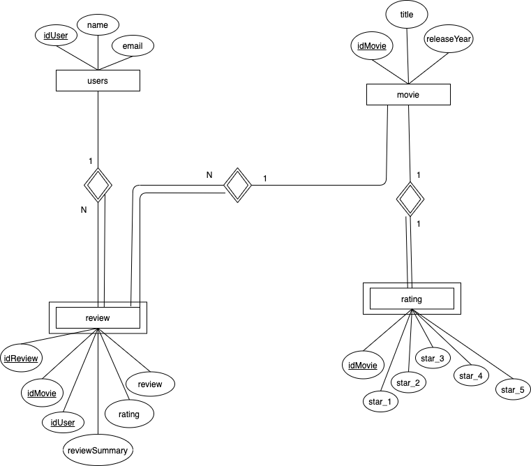

# Relatório técnico Final

## Introdução

Este documento contém os aspectos relevantes do desenho e implementação da fase final do projecto de LS.

## Modelação da base de dados

### Modelação conceptual

O seguinte diagrama apresenta o modelo entidade-associação para a informação gerida pelo sistema. 



Destacam-se os seguintes aspectos deste modelo:

* A entidade-associação _users_ permite guardar informações sobre o utilizador, tais como, o nome e o e-mail.
* _movie_ representa um filme em que temos o título do filme e a data de lançamento com a condição que só pode haver filmes com o mesmo título em datas de lançamento diferentes.
* _rating_ entidade fraca que contêm 5 contadores associados a um _movie_, cada contador corresponde a um rating (número de 1 a 5), em cada um destes contêm o número de votos dados.
* _review_ contêm as reviews dadas pelos utilizadores, sendo esta uma entidade fraca que contêm as PKs de _movie_ e _users_

### Modelação física ###

O modelo físico da base de dados está presente em [createTable](https://github.com/isel-leic-ls/2021-1-LI41N-G11/blob/master/src/main/sql/createTable.sql)

Destacam-se os seguintes aspectos deste modelo:

* No modelo físico garantimos a atomicidade de todas as opeações com as palavras reservadas _begin transaction_ e _commit_.
* Na entidade _users_ o parâmetro email é único.
* Na entidade _movie_ garantimos que não temos o mesmo title e o mesmo releaseYear utilizando UNIQUE, garantimos tambem os tuplos não nulos e o releaseYear é uma data entre 1900 e 2020.
* Na entidade _rating_ começamos com os tuplos em _DEFAULT_ 0, ou seja, os contadores dos ratings começam todos a 0.
* Na entidade _review_ garantimos que o rating dado pelo utilizador é um valor entre 1 e 5 utilizando a cláusula CHECK, e review e reviewSummary não podem ser nulos.


## Organização do software

### Processamento de comandos

A estrutura dos comandos é a seguinte, sendo os _headers_ opcionais, e os _parameters_ apenas obrigatórios para os comandos de _POST_.
```
{method} {path} {headers} {parameters}
```

Criamos uma _package_ _command_ onde inserimos todas as classes que nos ajudam a lidar com os comandos inseridos pelo utilizador. Temos também uma classe abstrata _CommmandParser_ da qual as classes _CommandParam_ e _CommandHeaders_ extendem, esta contêm um _HashMap_ com os dados inseridos pelo utilizador. O facto de usarmos um _HashMap_ permite que o utilizador possa colocar os dados em ordem aleatória. Nesta classe também verificamos se os dados são corretamente inseridos lançando uma exceção caso não o sejam. Na classe _CommandPath_ guardamos a _path_ inserida pelo utilizador. Por fim a classe _CommandRequest_ que como o nome indica contêm o pedido, ou seja, tem um _CommandPath_, _CommandParam_ e um _CommandHeader_.

De forma a lidarmos com os comandos criamos uma interface _CommandHandler_ que é implementada pela classe abstrata _DBHandler_. Criamos para cada comando, descrito na fase 1, uma nova classe que extende a classe _DBHandler_, cada classe contêm um template de um path. Cada classe Handler tem como responsabilidade executar o comando com os parâmetros dados, verificar se os parâmetros recebidos estão corretos e retornar um resultado. 

Criamos a package _results_ que consiste nos resultados dados pelos handlers, cada classe em results está associada a um comando específico e sabe retornar um resultado para o seu comando com os dados recebidos do handler, tanto em texto ou em HTML.

Cada handler recebe um _CommandRequest_ que tem o pedido feito pelo utilizador e verifica os parâmetros recebidos. Todos os handlers, por serem específicos de um comando, sabem quantos e quais parâmetros têm que receber, e antes de executar executam um método para verificar os parâmetros que recebeu, lançando uma exceção caso não sejam válidos.

A classe _CommandHeaders_ é composta por uma sequência de pares nome-valor. Em que o valor correspondente a _accept_ determina se o resultado produzido pela aplicação é escrito em texto (no caso de ser _"text/plain"_), ou escrito no formato _HTML_ (caso seja _"text/html"_). Caso o utilizador queira guardar o resultado num ficheiro, este indica o nome do ficheiro onde quer guardar o resultado. Por exemplo:
```
accept:text/plain|file-name:movies.txt
```

### Encaminhamento dos comandos

O encaminhamento dos comandos é feito pela classe _Router_, esta classe contêm uma árvore com todas as rotas possíveis para os _Handlers_. Esta árvore é composta por vários Nodes, cada Node contêm um template para o seu _path_, uma referência para um Handler e uma lista de Nodes por onde o path pode seguir. A árvore tem o método _add_ e _find_. O método _add_ recebe o _handler_ que quer adicionar e percorre o seu _path_ criando _nodes_ se for preciso até ter construido o seu _path_. O método _find_ recebe um _method_ e um _path_ que segue até encontrar o seu _handler_, que depois é retornado.

### Gestão de ligações

No _MovieReviewApp_ temos um _try catch_ em que dentro do _try_ começamos a _Connection_, isto é, cada vez que é executado um comando _Handler_ temos de lhe passar a _Connection_ atual. E no fim de todas as operações,fechamos a _connection_ no block finnaly do _try catch_  garantindo que fechamos todas as  _Connections_.

### Acesso a dados

Do modo a facilitarmos o acesso a dados, criamos a _package model_ que contem as classes _Ratings_, _Movie_, _Review_ e _Users_. No _MovieReviewApp_ temos um _HashMap_ em que guardamos os _ratings_ associados a cada _movie_. Sentimos esta necessidade na concretização do commando "GET /tops/ratings". 

De modo a obtermos o _id_ de algumas das entidades em sql, um vez que usamos atributos do tipo _bigserial_ isto é _auto increment_ atributo, tivemos de usar
 ```
 select currval 'users_iduser_seq'::regclass);
 ```
em que o 'users_iduser_seq' fomos buscar a _psql_ através do comando "\d users". Este _select_ retorna o valor atual do atributo neste caso idUser.

### HTML

De forma a escrevermos no formato _HTML__ criamos uma classe Element, que representa os elementos _HTML_. Para criar o código _HTML_ existem várias classes _HTML View_ que, recebem o CommandResult respectivo à própria _View_. Cada _View_ analisa os Elementos em cada _Result_ e cria Elementos de forma a representa-los em _HTML_.

### HTML FORMS

Para implementarmos o HTML FORMS, tivemos como modelo o excerto de código a baixo: 
```html
<form action="/movies" method="POST">
     <label for="title">Title: </label>
     <input type="text" id="title" name="title"><br>
     <input type="submit" value="Submit"><br>
</form>
```
Quando o _user_ carrega no botão de _submit_ é feito um pedido _POST_ para o _path_ indicado em **action**, neste caso "/movies". E os campos, são enviados dentro do _body_ do pedido _POST_. Esse pedido vai ser recebido pela nossa Servlet atráves do método, _doPost_, que vai transmitir o pedido à nossa App e no fim se tudo correr bem, mandamos um _status code_ 303 (_See other_) com a localização do recurso criado.

### Servlet
Na Fase 3 adicionamos o comando _LISTEN / port=xxxx_ que recebe o porto em que o _Servlet_ vai ficar à escuta de pedidos HTTP. Após darmos _start_ à _Servlet_ estamos aptos a continuar a usar a nossa aplicação e ao mesmo tempo estarmos a fazer pedidos à _Servlet_ através do _browser_. O _Servlet_ recebe pedidos em todos os _paths_ (/*, ou seja qualquer que seja o caminho). Quando não é encontrado o recurso pedido pelo utilizador, enviamos um _Status Code_ 404 (_Not Found_), caso contrário é enviado o _Status Code_ 200(_OK_).
De modo a descobrirmos o _HTML_ do recurso a ser enviado (no caso do utilizador ter pedido o recurso em _HTML_), criamos um _RouterViews_, este contém todas as _HTMLViews_ associadas a um respetivo _Result_. Quando o comando _EXIT /_ for executado a aplicação termina, e caso o _Servlet_ tenha sido iniciado este tambem é terminado.

### Heroku
Heroku é uma plataforma de serviço(platform as a service, _PaaS_) que permite disponibilizar a nossa aplicação para "o mundo" através da _cloud_. É uma ferramenta extremamente simples, que apenas com o comando:
```
git push heroku master
``` 
(e com mais algumas configurações), fazer _commit_ da nossa aplicação para "o mundo".


### Processamento de erros

De forma a lidar com os erros e com as exceções lançadas durante a execução de comandos, criamos as nossas próprias classes de exceções, colocando numa diretoria _exceptions_ em que guardamos uma _string_ especifica para cada caso. Temos uma classe para exceções do _path_, outra para exceções de parâmetros e ainda outra mais genérica.
Durante as ligações a base de dados e quando lidamos com erros de comandos introduzidos pelo utilizador lançamos as exceções que achavamos necessárias e lidamos com as mesmas na _MovieReviewApp_ na qual imprimi-mos o erro deixando o utilizador saber o erro cometido pelo mesmo, deixando a aplicação correr.

## Avaliação crítica

Todas as funcionalidades pedidas foram implementadas. Faltou nos melhorar o estilo da app.